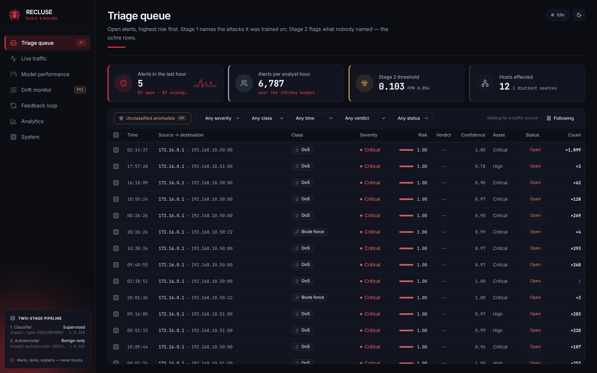
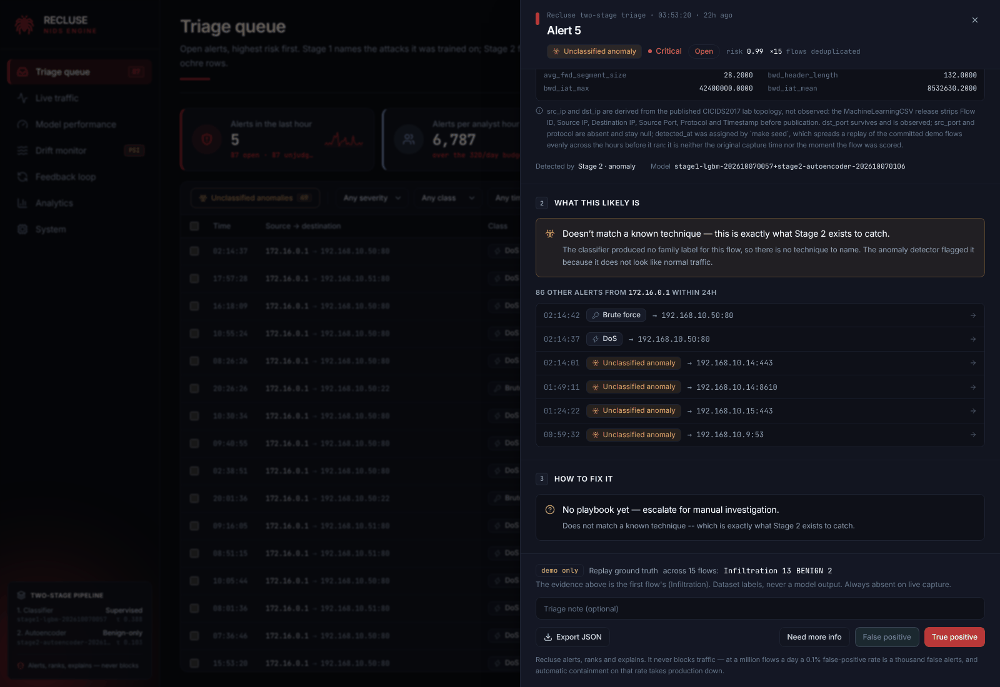
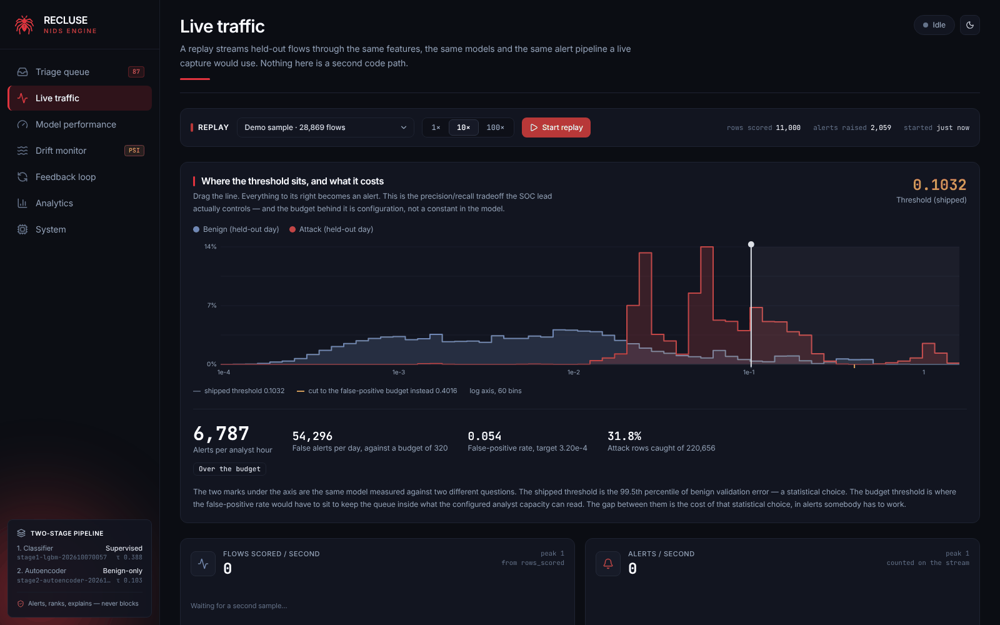
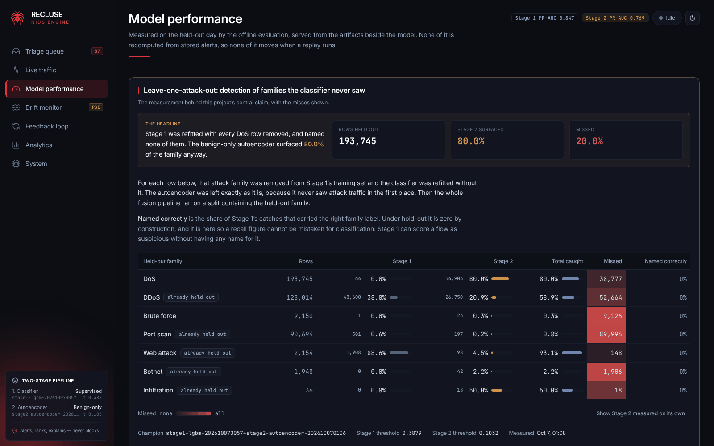

# Recluse

Machine-learning network intrusion detection with a SOC triage dashboard.

Two models, trained here, on labelled flow data:

| Model       | What it is                                   | Trained on                      | Answers                                | Artifact                |
| ----------- | -------------------------------------------- | ------------------------------- | -------------------------------------- | ----------------------- |
| **Stage 1** | LightGBM (a RandomForest baseline came first) | Labelled flows: benign + known attack families | "Which named attack is this?"          | `supervised_model.pkl`  |
| **Stage 2** | PyTorch autoencoder                          | **Benign traffic only**, no attack labels | "How unlike normal traffic is this?"   | `autoencoder.pt`        |

Stage 1 names what it knows. Stage 2 catches what nobody named. The claim the
project has to defend is that it detects attack traffic it was never trained
on, and the [leave-one-attack-out table](#fusion-and-leave-one-attack-out) is
what makes that measurable rather than asserted: refitted with every DoS flow
removed, Stage 1 named none of them, and the benign-only autoencoder surfaced
80.0% of the family anyway. A fifth still got through, and the table says so.

**The system alerts, ranks and explains. It never blocks traffic.**

---

## Quickstart

One command, from a clean clone, with nothing downloaded or trained first:

```bash
git clone https://github.com/Team-Arachnid/recluse.git
cd recluse
docker compose up --build        # or: make up
```

Open **<http://localhost:5173>**. On first start the backend migrates an empty
database, installs the committed model release (`backend/release/`), and seeds
a demo by replaying 28,869 real CICIDS2017 flows through the real pipeline, so
the triage queue opens on real alerts, each with its explanation, rather than on
empty panels. Then start a replay on the **Live** screen and watch new alerts
arrive. `docker compose down -v` starts over.

**Natively, with hot reload** — needs [uv](https://docs.astral.sh/uv/) and
Node 20.19+ or 22.12+:

```bash
make dev          # installs what is missing, migrates, installs the model release, runs both
make seed         # in a second terminal: fill the empty database with the demo
./make.ps1 dev    # Windows PowerShell: every target is mirrored, no make needed
```

- Dashboard — <http://localhost:5173>
- API health — <http://localhost:8000/api/v1/health>
- API docs — <http://localhost:8000/docs>

`make help` lists every target. To retrain from the dataset rather than use the
release, see [Reproducing the models](#reproducing-the-models).

---

## Status

| Phase | Scope                                   | State    |
| ----- | --------------------------------------- | -------- |
| 0     | Scaffolding                             | done     |
| 1     | Data + features                         | done     |
| 2     | Supervised classifier                   | done     |
| 3     | Anomaly detector                        | done     |
| 4     | Fusion + leave-one-attack-out           | done     |
| 5     | Backend API, replay, SSE                | done     |
| 6     | Frontend: seven screens                 | done     |
| 7     | Drift + active learning                 | done     |
| 8     | Packaging                               | done     |
| 9     | Real traffic                            | partial — burn-in run on this host; attack exercise not run |

Every v1 endpoint returns live data. Phase 9's live capture, shadow-mode
burn-in and local threshold calibration are built and were run on this host's
own traffic ([Real traffic](#real-traffic-phase-9)); its self-run attack exercise
belongs in a lab you own and has not been run, and
the [Roadmap](docs/Roadmap.md)'s acceptance checklist leaves that one line open.
The measured results are below and in [`reports/`](reports/).

The full documentation is a website, published from [`docs/`](docs/) to
**<https://team-arachnid.github.io/recluse/>**.

---

## The five-minute demo

What the dashboard is for, in the order the brief's demo narrative runs it.

1. **Frame the gap.** A signature IDS matches known patterns. The seeded queue
   already holds traffic it would have no signature for.
2. **Live → Start replay at 10×.** Real held-out flows are scored in batches of
   500 and alerts arrive over server-sent events, deduplicated as they land.
3. **Open a known attack.** The drawer answers three questions in a fixed order:
   *why* (one English sentence over a TreeSHAP chart), *what it likely is*
   (family, MITRE technique, host context) and *how to fix it* (a reviewed,
   static playbook).
4. **Filter to Unclassified anomaly.** One click. These have no family label:
   Stage 2 raised them because they do not look like normal traffic.
5. **Open one and read the ground truth.** In the seeded demo the second
   unclassified anomaly in the queue groups 15 flows, and the replay's own
   labels say 13 of them were **infiltration** — a family Stage 1 never saw in
   training. The one above it groups two flows that were both benign: Stage 2's
   false positives rank high too, and the queue shows both. The drawer badges
   ground truth demo-only; live capture has no labels.
6. **Model → the LOAO table.** That was not luck; here it is measured for every
   family, misses included.
7. **Live → drag the threshold.** At the shipped Stage 2 threshold the queue
   would take about 6,800 alerts per analyst hour; at four times it, about
   1,500. That is the trade-off a SOC lead actually controls.
8. **Submit a verdict.** The queue refreshes itself and the Feedback screen
   counts it: analyst judgement becomes the next retrain's training data.
9. **Close on the constraint.** Nothing here blocks traffic.

Screenshots of the containerised stack straight after `docker compose up` on a
clean clone — the seeded demo, nothing staged:

| | |
| --- | --- |
|  |  |
| **Triage queue** — sorted by risk, never by time; no accuracy tile | **Alert detail** — the unclassified anomaly whose bucket held 13 infiltration flows |
|  |  |
| **Live traffic** — the draggable threshold over both error distributions | **Model performance** — the leave-one-attack-out table, misses shown |

---

## Architecture

```
  ┌──────────────────────┐   ┌───────────────────────────────┐
  │ Replay               │   │ Live capture (Phase 9)        │
  │ held-out CICIDS2017  │   │ your own lab, shadow mode     │
  └──────────┬───────────┘   └───────────────┬───────────────┘
             └───────────────┬───────────────┘
                             ▼
  ┌──────────────────────────────────────────────────────────┐
  │ training/features.py — ONE feature module, imported by   │
  │ training and serving; schema hash checked at startup     │
  └──────────────────────────┬───────────────────────────────┘
                             ▼
  ┌──────────────────────────────────────────────────────────┐
  │ STAGE 1  LightGBM, multiclass       p(attack) > tau_sup  ├──▶ KNOWN, named family
  └──────────────────────────┬───────────────────────────────┘
                             │ everything Stage 1 did not alert on
                             ▼
  ┌──────────────────────────────────────────────────────────┐
  │ STAGE 2  autoencoder, benign-only   error > tau_anom     ├──▶ UNCLASSIFIED_ANOMALY
  └──────────────────────────────────────────────────────────┘
                             │ alerting rows only
                             ▼
  ┌──────────────────────────────────────────────────────────┐
  │ Alert pipeline: dedupe key → explain (TreeSHAP or        │
  │ per-feature reconstruction error) → narrate → MITRE map  │
  │ + static playbook → enrich + risk → persist → SSE push   │
  └──────────────────────────┬───────────────────────────────┘
                             ▼
  ┌──────────────────────────────────────────────────────────┐
  │ React triage dashboard — queue sorted by risk, alert     │
  │ detail, live, model, drift, feedback, analytics          │
  └──────────────────────────┬───────────────────────────────┘
                             │ analyst verdicts
                             ▼
  ┌──────────────────────────────────────────────────────────┐
  │ Jobs, never request handlers: nightly PSI drift          │
  │ (training.drift_job) and the guarded retrain             │
  │ (training.retrain) — champion vs challenger vs control   │
  └──────────────────────────────────────────────────────────┘
```

A flow Stage 1 is confident about becomes a named alert. Everything else falls
through to the autoencoder, and if it reconstructs badly it becomes an
`UNCLASSIFIED_ANOMALY`: an alert with no family label, which is the entire
point of the second stage and is visually distinct in the UI (its own colour,
glyph and words, because colour alone fails a colourblind analyst). The rule is
`training/fusion.py`, imported by both the serving path and the hold-out
evaluation, so the table below measures the rule the dashboard runs.

Every alert records which model version scored it — both stages,
`stage1-…+stage2-…` — because an audit trail that cannot tell two detectors
apart is not one.

---

## Non-negotiable constraints

These are properties of the build, not preferences. Several are asserted by
tests so they cannot rot.

**No auto-block, anywhere.** There is no endpoint, button or config flag that
drops traffic. `IDS_ALLOW_AUTO_BLOCK` exists only so the constraint is
greppable: setting it to true is rejected at startup
(`backend/tests/test_config.py`), and no route path may contain `block`,
`drop` or `quarantine` (`backend/tests/test_api_surface.py`).

**Why alert and not block — the arithmetic.** At the configured volume of
**1,000,000 flows per day**, a false-positive rate of just 0.1% is **1,000
false alerts a day**. Auto-blocking on that takes production down: every one of
those is a legitimate connection severed, and on a busy day the outage is the
attack's effect delivered by the defender. So the system alerts, ranks and
explains, and containment — if it is added at all — stays manual, confirmed by
an analyst and audited.

**The threshold is a budget, not a default.** `tau_sup` is chosen from analyst
capacity rather than set to 0.5:

```
max_alerts_per_day = ANALYST_CAPACITY_PER_HOUR × ANALYST_SHIFT_HOURS
                   = 40 × 8                                   = 320 alerts/day
target_FPR         = max_alerts_per_day / EXPECTED_DAILY_FLOW_VOLUME
                   = 320 / 1,000,000                          = 3.2 × 10⁻⁴
tau_sup            = smallest threshold whose validation-day FPR ≤ target_FPR
                   = 0.3879   (126 false alerts in 396,328 benign rows)
```

All three inputs are in `.env.example` and the service logs the resulting
budget at startup. A default of 0.5 would have been an arbitrary number that
happens to sit nearby; this one is derived, persisted inside the model artifact,
and re-derived from the same budget every time a model is retrained.

**Temporal splits only.** `train_test_split(shuffle=True)` is never used. Flow
records in this dataset are heavily duplicated, so random splitting leaks
near-identical rows across train and test and manufactures 99.9% scores. Phase 1
drops every row duplicated across splits and reports how many, so none is
shared.

**The anomaly model never sees attack labels.** It trains on benign traffic
exclusively, and that is asserted in code twice (when the split is built and
again before the optimiser exists) rather than intended. This is what makes
novel-attack detection a real claim instead of a relabelled supervised model.

**Train and serve share one feature module.** `backend/training/features.py`
is imported by both. The scaler, feature order and a SHA-256 hash of that order
are persisted in one bundle; the service recomputes the hash at startup and
refuses to run on a mismatch, because a mismatched column order produces
garbage scores without raising anything. `backend/tests/test_parity.py` builds
the matrix from real flows both ways — a Parquet frame the way training does,
and a JSON round trip through `POST /score` the way serving does — and requires
them to be identical bit for bit.

**No training in a request handler.** Training is offline batch; the API loads
artifacts once, in the lifespan context. Drift and retraining are jobs.

**Every alert is explainable.** TreeSHAP top-5 for Stage 1, per-feature
reconstruction error for Stage 2, both turned into one English sentence from a
static phrase map. The pipeline refuses to store an alert without an
explanation.

**Remediation is reviewed text, never generated.** Each family maps to a
static playbook (`backend/app/remediation.py`); an unclassified anomaly gets the
honest "no playbook — investigate" entry rather than invented advice.

**Accuracy is never a headline number.** On traffic that is 99% benign, a model
that always answers "benign" scores 99%. Reported metrics are PR-AUC, per-class
recall, false-positive rate and alerts per analyst per hour. There is no
accuracy tile in the UI, and a test asserts the dashboard renders none.

**No mock data.** Every number on every screen traces to a model run or to
rows in the database. A sparkline with no measured series behind it is not
drawn, and `make seed` fills the database by running real flows through the
real pipeline rather than by inserting rows.

---

## Dataset

**CICIDS2017** (Canadian Institute for Cybersecurity, University of New
Brunswick), used for its day structure:

| Day       | Contents                                                        | Role               |
| --------- | --------------------------------------------------------------- | ------------------ |
| Monday    | Benign only                                                     | Autoencoder train  |
| Tuesday   | FTP-Patator, SSH-Patator                                        | Train              |
| Wednesday | DoS Hulk / GoldenEye / Slowloris / Slowhttptest, Heartbleed      | Train              |
| Thursday  | Web attacks (AM), infiltration (PM)                             | Validation         |
| Friday    | Botnet, port scan, DDoS                                         | Test               |

The full dataset is not committed (`make data-fetch` downloads it). Two things
derived from it are: the trained models in `backend/release/`, and
`backend/release/demo_flows.parquet` — 28,869 unmodified rows of the two
held-out days, every 40th flow in capture order plus every flow of the rare
families (infiltration, web attacks, botnet), with the dataset's own labels.
`demo_flows.json` records exactly what was kept.

> Iman Sharafaldin, Arash Habibi Lashkari and Ali A. Ghorbani, "Toward
> Generating a New Intrusion Detection Dataset and Intrusion Traffic
> Characterization", 4th International Conference on Information Systems
> Security and Privacy (ICISSP), Portugal, January 2018.

Two caveats up front: the original CICIDS2017 labels contain documented errors
(corrected re-releases exist), and NSL-KDD is avoided entirely because it
derives from 1999 traffic.

---

## Results

Every figure below is from the models in `backend/release/`, measured by the
commands in [Reproducing the models](#reproducing-the-models) and written up in
[`reports/`](reports/).

### Stage 1

LightGBM, 92 features under the bucketed port encoding, early-stopped at
iteration 227 against the Thursday validation day. The RandomForest baseline was
trained, evaluated and written up first
([`reports/phase2_supervised_rf.md`](reports/phase2_supervised_rf.md), 300
trees, validation PR-AUC 0.7010) and is kept as a fallback artifact with its own
matching preprocessing bundle; LightGBM was promoted because it beat it on the
validation day.

| | Validation (Thu) | Test (Fri) |
| --- | --- | --- |
| Benign share of the split | 99.5% | 63.0% |
| **PR-AUC** (headline) | **0.8816** | **0.8468** |
| ROC-AUC | 0.9965 | 0.8820 |
| FPR at `tau_sup` | 3.18 × 10⁻⁴ | 1.63 × 10⁻⁴ |
| Projected false alerts/day at V = 1,000,000 | 318 | 163 |
| **Alerts per analyst per hour** | **39.7** | **20.3** |
| Accuracy *(table cell only, never a headline)* | — | 0.630 |

#### PR-AUC, not ROC-AUC

Look at the validation column, then the test column. ROC-AUC reads **0.9965**
where attacks are 0.55% of the traffic and **0.8820** where they are 37% of it —
the same model, and a 0.11 swing that says more about the class balance than
about the classifier. ROC's false-positive rate is computed against the benign
total, so on a day that is 99.5% benign, a few hundred false alarms barely move
it, even though a few hundred false alarms is an analyst's whole shift.
Precision is computed against what the model *flagged*, which is what an
analyst actually reads, so PR-AUC prices every false alarm at what it costs the
queue. Here it barely moves (0.8816 → 0.8468). Both curves are drawn side by
side on the Model screen with this caption; PR-AUC is the headline everywhere.

### What Stage 1 can and cannot do

The temporal split gives Stage 1 a vocabulary of `benign`, `dos` and
`brute_force` — the only families Tuesday and Wednesday carry. CICIDS2017 runs
each family on one day, so **every attack on the Friday test day is a family
Stage 1 has never seen**:

| Family on the test day | Rows | Flagged by Stage 1 | Recall |
| --- | --- | --- | --- |
| `ddos` | 128,014 | 48,600 | **38.0%** |
| `port_scan` | 90,694 | 501 | **0.6%** |
| `botnet` | 1,948 | 0 | **0.0%** |

DDoS partially generalises from Wednesday's DoS traffic; port scan and botnet
resemble nothing in the training days and are missed almost entirely. Across the
day Stage 1 surfaces 22.3% of the attack traffic, so **77.7% of it produces no
Stage 1 alert — the measured size of the gap Stage 2 exists to close.**

A `web_attack` class exists in the label map but is held out of training: on
the training days it collapses to 11 Heartbleed rows, and 11 rows against
821,166 under balanced class weights earn a weight in the thousands. The support
floor and what it excluded are reported rather than quietly applied.

### Destination-port ablation

Trained twice, everything but the encoding identical
([`reports/port_ablation.md`](reports/port_ablation.md)):

| Encoding | Features | Validation PR-AUC |
| --- | --- | --- |
| raw port | 70 | 0.8724 |
| bucketed (IANA service group + top-20 one-hot) | 92 | **0.8816** |

The raw port gives no gain, so nothing here rests on memorising the lab's port
assignments. Bucketed ships because it asks what *kind* of service a flow hit
rather than which port this particular lab used — and Phase 9 points the same
model at a network whose assignments are nothing like CICIDS2017's.

### Stage 2

A PyTorch autoencoder, `input(92) → 64 → 32 → 16 → 32 → 64 → output(92)`,
17,612 parameters, fitted on **1,191,239 benign flows and nothing else** —
Monday in full plus the benign rows of Tuesday and Wednesday
([`reports/phase3_anomaly.md`](reports/phase3_anomaly.md)).

`tau_anom = 0.1032`, the 99.5th percentile of reconstruction error on the
Thursday validation day's benign rows: benign traffic from a day the network
never trained on.

| Measured on the Friday test day | Stage 2 | Stage 1, for comparison |
| --- | --- | --- |
| **PR-AUC** | 0.7695 | **0.8468** |
| ROC-AUC | **0.9093** | 0.8820 |
| Attack recall at its own threshold | 31.3% | 22.3% |
| False-positive rate at that threshold | 5.39 × 10⁻² | 1.63 × 10⁻⁴ |
| Median benign / attack reconstruction error | 5.00 × 10⁻³ / 5.87 × 10⁻² | — |

Two rows of that table are not a fair fight. **The recall figures are not
comparable**: Stage 2's 31% is bought with over 300 times Stage 1's
false-positive rate, because the thresholds are cut by different rules — a
benign percentile against an analyst budget. What *is* comparable is the
ranking: having never been shown an attack label of any kind, Stage 2 orders
Friday's traffic with a higher ROC-AUC than the supervised model and a PR-AUC
within eight points of it.

Per family, where the average comes apart:

| Family on the test day | Rows | Stage 1 recall | Stage 2 recall |
| --- | --- | --- | --- |
| `ddos` | 128,014 | 38.0% | **53.7%** |
| `botnet` | 1,948 | 0.0% | **2.2%** |
| `port_scan` | 90,694 | 0.6% | **0.3%** |
| benign *(false positives)* | 375,238 | 0.02% | 5.39% |

**Port scan is missed by both stages**, and that is the number to carry
forward. Stage 2's own explanation of port-scan traffic is its sharpest —
`init_win_bytes_forward` (29% of the error), `psh_flag_count` (13%),
`ack_flag_count` (11%), a recognisable SYN-scan signature — but the score is a
*mean* over 92 features, and port-scan flows are short and sparse: they
reconstruct easily on most columns, so a large error on five of them is divided
by ninety-two. Stage 2 responds to the right features and still ranks the row
below the line.

**The threshold costs more than the queue can absorb.** `tau_anom` alerts on
0.50% of Thursday's benign flows by construction and on 5.39% of Friday's —
10.8 times more often, 53,915 false alerts a day against a budget of 320.
Nothing about the model changed between those two numbers; the benign traffic
did. That is domain shift measured across two days of one lab network, and it is
the argument for Phase 9's shadow-mode burn-in stated as evidence. The
budget-equivalent threshold (0.4016, the 99.968th percentile) is recorded beside
the shipped one, and the Live screen's slider moves between them.

### Stage 2 against the classical detectors

Every detector fitted on benign rows only, through the same input transform,
scored on one shared 42,179-row arena from the validation day (choosing between
detectors is a choice, and choices are not made on the test day):

| Detector | PR-AUC | ROC-AUC |
| --- | --- | --- |
| Autoencoder | 0.3083 | **0.9335** |
| **LOF** | **0.3545** | 0.9323 |
| IsolationForest | 0.0954 | 0.7342 |
| ECOD (PyOD) | 0.0803 | 0.7136 |

**On this run, LOF beats the autoencoder on PR-AUC.** That is reported rather
than hidden. It is not a defeat for the two-stage design — the design needs a
Stage 2 that catches families nobody named, not one that is a neural network —
and it is not stable either: see [Reproducibility](#reproducibility), where the
same code and seed trained on another machine put the autoencoder at 0.6232 on
the same arena. A ranking that flips between two training runs is not a result
to build on, and the honest summary is that a parameter-free detector does this
job about as well on this data.

### The bug worth reporting

The first Phase 3 run produced a detector that ranked attack traffic *below*
benign traffic: ROC-AUC 0.2337 on the arena, where the classical baselines
scored 0.71 to 0.86 on the same rows. The cause was not the network.
`RobustScaler` divides by the interquartile range, and where a column's IQR is
zero scikit-learn leaves the divisor at 1.0, so the column passes through
unscaled. Over three quarters of benign flows report `idle_std` of exactly zero
while the ones that idle report up to 7.6 × 10⁷; squared, that one column owned
93.9% of what the MSE loss could see. Stage 2 now reads the shared matrix
through `sign(x) · log1p(|x|)` clipped to ±6, chosen on the validation day over
three seeds ([`reports/input_ablation.md`](reports/input_ablation.md)).

### Fusion and leave-one-attack-out

Each family is removed from Stage 1's training set, Stage 1 is refitted (its
threshold re-cut to the same false-positive budget), Stage 2 is left untouched
because it never saw an attack label of any kind, and the fused pipeline is run
over every row of the family in the capture. Per-fold thresholds and method
caveats are in [`reports/loao.md`](reports/loao.md).

| Held-out family | Rows | Caught by Stage 1 | Caught by Stage 2 | Total recall | **Missed** |
| --- | --- | --- | --- | --- | --- |
| `dos` | 193,745 | 0.0% | **80.0%** | 80.0% | 20.0% |
| `ddos` | 128,014 | 38.0% | **20.9%** | 58.9% | 41.1% |
| `brute_force` | 9,150 | 0.0% | **0.3%** | 0.3% | 99.7% |
| `port_scan` | 90,694 | 0.6% | **0.2%** | 0.8% | 99.2% |
| `web_attack` | 2,154 | 88.6% | **4.5%** | 93.1% | 6.9% |
| `botnet` | 1,948 | 0.0% | **2.2%** | 2.2% | 97.8% |
| `infiltration` | 36 | 0.0% | **50.0%** | 50.0% | 50.0% |

**The row that carries the claim is `dos`.** Stage 1 was refitted with all
193,745 DoS rows removed; its vocabulary became `benign, brute_force`, its
threshold dropped from 0.3879 to 0.0515 to keep the same false-positive budget,
and it named **none** of them. The autoencoder, which has never been shown an
attack label, surfaced 80.0%. A fifth of the family still got through.

`brute_force` is the same experiment with the opposite answer. With it removed,
Stage 1 catches 0% and Stage 2 0.3%: nine thousand failed-login flows,
essentially invisible, because the pattern that makes brute force obvious to a
human is the *repetition* — the same short session hundreds of times — and
nothing in a per-flow feature vector can see that.

**Three things the table's columns hide** (all reported in `reports/loao.md`):

- *Caught is not named.* A held-out family can clear `tau_sup` under a
  *different* family's label: Thursday's HTTP brute force looks like Tuesday's
  FTP/SSH brute force, so Stage 1 flags 88.6% of `web_attack` and names 0% of it
  correctly. Read the Stage 1 column as *an alert was raised*, never as
  classification.
- *Stage 2's column is marginal, not standalone.* It is what Stage 2 adds on
  rows Stage 1 passed through. On DDoS Stage 2 alone catches 53.7%, but adds
  20.9% in the cascade, because both stages respond to the same extreme flows.
- *The volume at `tau_anom` does not fit a queue.* About 6,700 alerts per
  analyst per hour on the test day against a budget of 40. The budget threshold,
  cut on the validation day, still costs 1,009 there — 25.2× over — while DoS
  recall falls from 80.0% to 28.5%. What actually moves this is not a threshold:
  it is **dedup** (a full 100× replay of the test day streamed 96,370 alert
  events to one held-open connection without losing any, and the queue received
  them as 6 rows; [`reports/phase5_api.md`](reports/phase5_api.md) has the 10×
  version), **risk ranking**, and **recalibration against a local baseline**
  (Phase 9).

### Drift and active learning

- **Drift** is measured over a systematic sample of *scored traffic*, not over
  stored alerts (an alert is a row that already crossed a threshold), as PSI per
  feature against quantile bins cut from the training split. The seeded demo's
  drift run, over 1,155 sampled flows of the held-out days, finds 25 of 92
  features significantly shifted (max PSI 0.56) — the Thursday/Friday traffic
  genuinely is not the Tuesday/Wednesday traffic it is compared with.
- **Retraining** consumes analyst verdicts and fits three models: the champion,
  a challenger with the labels, and a *control* fitted the same way without them.
  Promotion is gated on validation-day PR-AUC. In the verification run the
  control reproduced the champion exactly (0.8816 = 0.8816), so the labels' effect
  is isolated: seven labels moved the challenger to 0.8865 and it was promoted
  ([`reports/phase7_retrain.md`](reports/phase7_retrain.md)). The release does
  **not** ship that challenger: its labels came from a replay of the test day,
  so its test-day numbers are no longer a held-out estimate.
- **The benign baseline refit is guarded against poisoning**: a row enters the
  autoencoder's refit pool only on an analyst's false-positive confirmation, no
  source host may supply more than 20% of the pool, and below 200 rows the pool
  is refused outright. On a replay every unclassified anomaly is attributed to
  one derived host, so the guard refuses the pool — the expected outcome — and
  the refit report says why.

---

## Real traffic (Phase 9)

Replay is how the numbers above are produced. Phase 9 adds a second traffic
source beside it — live capture — through the *same* `features.py`, the same
models and the same alert pipeline. A live path with its own scoring code would
be the train/serve skew the feature contract exists to prevent.

### Packets to the flows the models know

`backend/app/flowmeter.py` turns packets into the 70 CICIDS2017 columns the way
CICFlowMeter-V3 made them, because the models only understand that quantity.
Reading the training rows against CICFlowMeter's source showed that "the way it
made them" includes several quirks, and the meter reproduces each one rather
than handing the models numbers they never saw:

- **The eight flag columns hold the first packet's flags, permuted.**
  CICFlowMeter wrote the values by iterating a Java `HashMap` under a fixed
  header, so the column named `PSH` holds SYN, `FIN` holds RST, and so on. Every
  flag combination in the dataset decodes to a real first packet under that
  mapping — an ECN-negotiating SYN (SYN, ECE, CWR) included.
- The first packet is counted twice in the all-packet length statistics
  (`average_packet_size = packet_length_mean × (n+1)/n` on every training row).
- A UDP packet's header length is the *last TCP header decoded* — no UDP flow
  in the dataset carries UDP's real 8-byte header.
- A TCP flow ends at the first FIN, so the rest of the teardown becomes its own
  short flow (the "TCP appendix" documented in the dataset).
- Zero-duration flows are counted and not scored: their rates are infinite,
  Phase 1 dropped every such row, and neither model has seen one. That
  includes single-packet probes, which is a blind spot this states rather than
  hides.

### Where capture may run

Only where the operator says. The API captures on interfaces listed in
`IDS_LIVE_INTERFACES` (empty by default) and reads pcaps only from
`IDS_LIVE_PCAP_DIR`; no request can name anything else. Capture is lawful only
on a network you own or are explicitly authorised to monitor.

### Shadow mode first, then a local threshold

`POST /ingest/start` with `mode: "shadow"` scores every flow and alerts no one,
keeping each flow's Stage 1 confidence and Stage 2 error. `make calibrate` cuts
a local `tau_anom` from them at the same 99.5th percentile, and alert mode is
refused until that exists for the Stage 2 model that is serving — so no live
alert reaches the queue before a burn-in has priced the network's normal.

Alert mode then decides *and ranks* at the local threshold. An anomaly's risk is
its headroom past the threshold that produced it, measured in the error
distribution that threshold was cut from, so the calibration keeps the burn-in's
error histogram beside the threshold and live alerts are ranked in it. Ranked
against the 2017 distribution instead, a flow just over this network's bar sits
far past the dataset's and would top the queue as critical — which is what the
first alerting run here did, before the fix.

### What happened on this host

Capture ran on this container's own interfaces only — its loopback and its
egress interface, not in promiscuous mode — so everything metered was traffic
this host itself sent or received: its own dashboard sessions and API calls, and
the package-index lookups a development machine makes. That is the brief's "your
own machine's interface" option: limited diversity, unambiguous ownership.

| | CICIDS2017 (validation day) | This host (shadow burn-in) |
| --- | --- | --- |
| Flows | 396,328 benign | 7,972 |
| Median Stage 2 error | 0.0052 | 0.0263 |
| 99th percentile | 0.0694 | 0.5684 |
| **`tau_anom` (99.5th percentile)** | **0.1032** | **0.6393** |
| Flagged at the CICIDS2017 threshold | 0.50% (by construction) | **11.8%** |
| Named by Stage 1 at `tau_sup` | — | 0.0% |

**The gap is the finding.** The local threshold is 6.2× the dataset's, and the
median flow here reconstructs five times worse than the 2017 lab's median.
Pointed at this traffic unchanged, the shipped threshold would have put 11.8% of
perfectly normal flows in front of an analyst — the brief's predicted
false-positive spike, measured. Stage 1 named none of them: it can only name
2017's families in 2017's feature space, so it under-fires on live traffic
exactly as predicted, and Stage 2 carries the weight. The window was dominated
by `tcp/8000`, `tcp/5173`, `tcp/443` and `udp/53`; `reports/phase9_live.md`
lists everything it held, because a burn-in teaches the threshold that whatever
it saw is normal.

Then alert mode, at the local threshold, for five minutes of the same traffic:
3,776 flows scored and 13 alerting flows (0.34%), which dedup folded into 2
alerts — against the 11.8% of the burn-in the dataset threshold flagged. Each
live alert carries the addresses, ports and protocol observed on the wire and the
threshold it was decided at. Both were this host's own loopback flows, one to
the dashboard's dev server and one to the API, with errors of 0.678 and 0.662
against the local 0.639 — and that run is where the ranking bug above showed
itself: they reached the queue as critical. The alerting run after the fix had
only the local API traffic to watch (the dashboard's dev server had stopped) and
raised nothing in 1,168 flows, so the corrected ranking is pinned by a test that
drives the live scoring path with the real models
(`test_a_live_alert_is_ranked_against_the_threshold_it_was_decided_at`) rather
than by a live alert.

### Not done here: the self-run attack exercise

The brief's last Phase 9 step is to attack hosts you own, inside an isolated
lab, and check each family is caught and explained. That was not run in this
session. It belongs in a lab you control: run the capture in alert mode on the
lab's interface, run the exercises there, and each family should reach the
queue with its explanation. Until then the checklist line stays open, and
nothing here claims live attack detection.

---

## Reproducibility

- **Stage 1 is deterministic.** Retraining the champion from scratch on another
  machine reproduces its Phase 2 report exactly; only the version string
  changes. The retrain's control arm reproduces it too.
- **Stage 2 is not, across machines.** The same code and seed, trained once
  when Phase 3 was first written up and again for this release, agree on
  everything a deployment reads — test-day PR-AUC 0.7728 vs 0.7695, ROC-AUC
  0.9045 vs 0.9093, `tau_anom` 0.1098 vs 0.1032, DoS hold-out recall 75.5% vs
  80.0% — and disagree sharply on one figure: PR-AUC on the 42,179-row arena,
  **0.6232 vs 0.3083**, which is what decides whether the autoencoder or LOF
  "wins" the baseline comparison. Floating-point reductions in multi-threaded
  CPU kernels differ between machines and compound over sixty epochs. Treat the
  arena ranking as unsettled, not as a finding.
- The release records the library versions that wrote it
  (`backend/release/MANIFEST.json`); `uv sync --locked` installs those versions,
  and the installer warns if the ones present differ.

---

## Limitations

Stating these makes the work more credible, not less.

- **Flow-level features cannot see encrypted payload content.** Web attacks
  ride inside ordinary-looking HTTP sessions; the attack is in the payload.
- **CICIDS2017 is synthesised lab traffic.** A real enterprise baseline is
  messier and drifts faster.
- **The autoencoder flags *unusual*, which is not *malicious*.** A new backup job
  will fire alerts. Measured, not predicted: at `tau_anom` Stage 2 flags 5.39% of
  the test day's benign flows — 20,231 rows of ordinary traffic that simply look
  unlike Thursday's ordinary traffic.
- **An adaptive adversary can shape traffic to stay under the threshold.** Both
  thresholds are fixed numbers on per-flow statistics, and the per-flow view is
  exactly what slow, low-volume attacks are designed to defeat.
- **Leave-one-attack-out measures generalisation to held-out *known* attacks.**
  It is a proxy for genuinely novel ones, not proof.
- **Per-flow features miss repetition-shaped attacks.** Brute force and port
  scanning are the misses above for that reason, not for want of tuning.
- **Domain shift is large and immediate.** Moving `tau_anom` from the day it was
  calibrated on to the next day of the same capture raised its false-positive
  rate 10.8-fold. A model trained on 2017 lab traffic pointed at today's
  mostly-TLS traffic will over-fire until it is recalibrated locally.
- **The live flow meter copies CICFlowMeter's quirks on purpose.** Live flows
  have to be the quantity the models were trained on, artifacts included (the
  permuted flag columns, the doubled first packet, UDP's borrowed header
  length). Fixing any of them means fixing it in the training data too and
  retraining, never in one place alone.
- **Replay addresses are derived, not observed.** The published CSVs strip IPs
  and timestamps, so replayed alerts carry addresses from the lab's documented
  topology and say so on every alert. Every unclassified anomaly is attributed to
  one host, which is also why dedup groups them per five-minute window.

## Next steps

Honest ones, in the order they would most change the numbers above.

0. **Run Phase 9's attack exercise** in an isolated lab you own, with the capture
   in alert mode on the lab's interface: the one acceptance line still open, and
   the only test of detection on traffic CICIDS2017 never shaped.
1. **Per-host, windowed features** — counts of distinct ports and sessions per
   source over seconds to minutes. Brute force and port scan are invisible per
   flow and obvious per host; this is the single largest gap in the LOAO table.
2. **A Stage 2 score that is not a mean** — the top-k feature errors, or the
   maximum, so a five-feature SYN-scan signature is not divided by ninety-two.
3. **Settle Stage 2 against LOF** over several training runs and seeds rather
   than one, and consider an ensemble; the arena result above flipped between
   two runs.
4. **Corrected labels** — retrain and re-measure on a corrected CICIDS2017
   re-release, and on a second dataset, before trusting any per-family figure to
   the second decimal.
5. **A placebo arm for retraining** — refit on a few randomly perturbed rows, so
   a promotion earned by seven labels can be told apart from the variance any
   seven-row change produces in a boosted ensemble.
6. **Concurrent writers** — a unique constraint on the dedupe key with an
   upsert, before replay and live capture are allowed to write at once.

## Authorisation

Phase 9 captures live traffic and runs self-generated attacks. Both are scoped
to networks and hosts that are owned or explicitly authorised for testing.
Packet capture on a network you do not control is illegal in most
jurisdictions regardless of intent, and so is pointing an attack tool at a
host you do not own.

---

## Reproducing the models

The release is a convenience, not a dependency. From the dataset:

```bash
make data-fetch       # download CICIDS2017 into data/raw (~885 MB)
make data             # clean, temporally split, fit the preprocessing bundle
make train            # Stage 1 RandomForest baseline, then evaluate the test day
make train-lgbm       # LightGBM upgrade, promoted only if it wins, re-evaluated
make train-anomaly    # Stage 2: benign-only autoencoder, tau_anom, baselines
make loao             # the leave-one-attack-out table
make drift-reference  # the PSI reference bins
make release          # maintainers: snapshot the serving model into backend/release
```

A model you train always wins over the release: `make models` (and the
container) install the release only into an artifacts directory with nothing
serving in it, or over an earlier release that nobody has changed since.

## Development

```bash
make test         # backend pytest + frontend vitest
make lint         # ruff check + tsc --noEmit
make migrate      # alembic upgrade head
make seed         # demo database from real flows; ARGS=--reset starts over
make models       # install the committed model release
make openapi      # rewrite the API contract snapshot and regenerate the types
make drift        # one PSI snapshot over the sampled window (a nightly job)
make retrain      # champion vs challenger vs control from analyst verdicts
```

The backend suite runs against a throwaway database built by the real Alembic
history and the committed release installed into a throwaway artifacts
directory, so it passes on a clean clone and never touches your data.

Frontend API types are **generated** from the OpenAPI schema into
`frontend/src/types/api.d.ts`, never hand-written. The schema is committed as a
contract snapshot: a backend test fails if the served schema drifts from it, and
a frontend test fails if the types are not exactly what it generates, so a wire
format change cannot land without the dashboard's types moving with it.

SQLite is the development database. The ORM uses portable column types
exclusively, so moving to Postgres is a change to `IDS_DATABASE_URL` (plus a
driver) and nothing else; `backend/tests/test_schema_portability.py` compiles
every column type against both dialects to keep that true.
